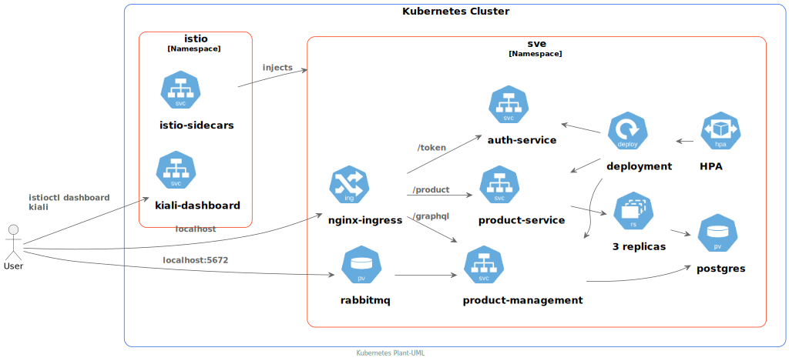
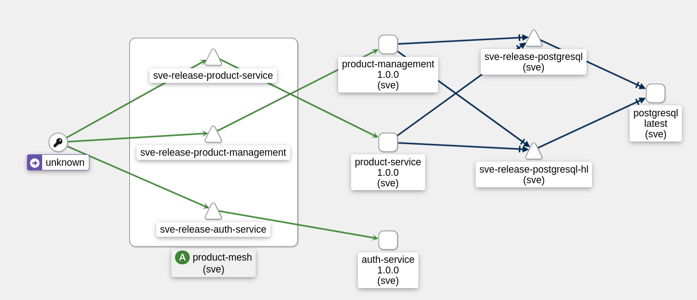
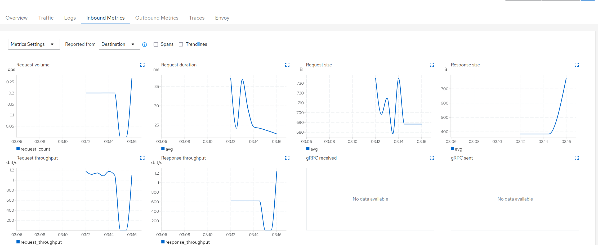
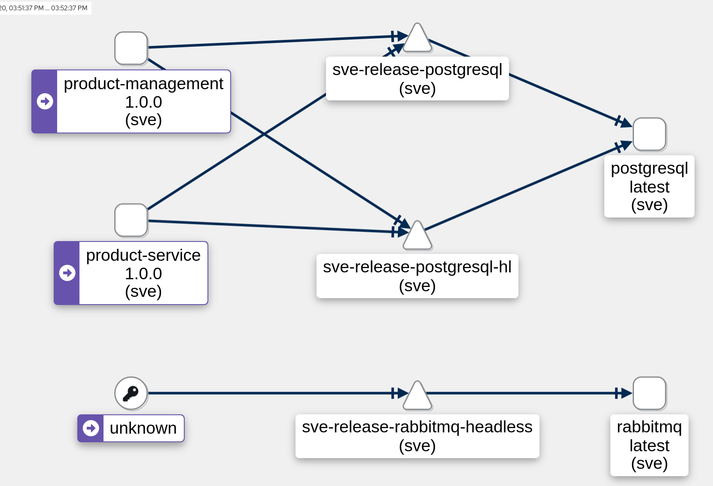

# Requirements

To get started with deploying the services, you will need to have the following installed on your machine:

- [Docker](https://docs.docker.com/install/)
- [Kubectl](https://kubernetes.io/docs/tasks/tools/install-kubectl/)
- [Minikube](https://kubernetes.io/docs/tasks/tools/install-minikube/)
- [Helm](https://helm.sh/docs/intro/install/)
- [Istio](https://istio.io/docs/setup/getting-started/#download)

Once you have the above installed, you can follow the steps below to deploy the services.

## Architecture

The following diagram shows the architecture of our deployment:



Our services are deployed in a kubernetes cluster, which is running on minikube.
The services are deployed to the `sve` namespace.
The ingress is exposed via minikube tunnel, which allows us to access the ingress via localhost. The ingress routes traffic to the correct service based on the path of the request.

The `auth-service` is responsible for authenticating users and generating a JWT token which is used to authenticate requests to the other services (`product-service`).

The `product-service` is responsible for handling requests to the `/product` endpoints. It checks the JWT token to verify that the user is authenticated and authorized to access or update the resource. Updates are written to the postgres database.
This service also listens for messages published on the `rabbitmq` queue and updates the database accordingly. The deployment for this also ensures 3 replicas are running at all times. The `rabbitmq` service is also configured so it is a `LoadBalancer` type service, which means it is exposed outside of the cluster. This allows our demo application `RabbitMQSimulator` to publish messages to the queue.

The `product-management`service is a graphql implementation of the `product-service` written in C\#. It also uses the postgres database.

Inside the `istio` namespace, we have the istio service mesh running. The service mesh allows us to inspect and monitor our services and also provides us with tracing capabilities.

It also shows that our deployments are performed with helm.

## Kiali

The following images demonstrate the kiali dashboard which allows us to monitor our services.

This image shows how different incoming requests are routed to the services and what path they take through the service mesh.



When looking at the `product-management` service, we can take a look at the incoming metrics and see how many requests are being made to the service, how long they take and how many are failing.




When we start our `RabbitMQSimulator` application, we can see that `rabbitmq` is receiving messages. Sadly it does not show, that the `product-service` is receiving the messages and updating the database.



## Simulator

The Simulator plays a crucial role in our deployment architecture, embodying two use cases within the system. These use cases are carried out by separate .NET projects that run concurrently to simulate the real-world interactions with our services.

The first use case involves the interaction with RabbitMQ. The Simulator acts as an external application that communicates with the rabbitmq service in our Kubernetes cluster. In this scenario, it sends messages to the RabbitMQ queue. This mirrors the behaviour of an external system or microservice in a typical architecture that would publish messages to this queue.

In the second use case, the Simulator continuously sends requests to the product-management service, our GraphQL service, imitating the behaviour of a client interacting with our system. It sends requests at regular intervals, providing us with real-time data on how the service is handling incoming traffic. This use case provides invaluable insights into the performance and reliability of our GraphQL service, including its ability to handle load, response times, and error rates.

## Deploying the services

If you are using minikube, you will need to start it up first (ensure docker is running and that you are using the docker driver):

```bash
minikube start
```

and to view the dashboard run:

```bash
minikube dashboard
```

We could now deploy the services, but first we should setup the istio service mesh.

To do this, run the following command:

```bash
helm repo add istio https://istio-release.storage.googleapis.com/charts
helm repo update
helm install istio-base istio/base -n istio-system --create-namespace
helm install istiod istio/istiod -n istio-system --wait
```

verify that the istio services are deployed by running:

```bash
helm ls -n istio-system
```

Next it would be good to setup the monitoring services, to do this run first change the directory to the istio directory and add the istio bin to your path:

```bash
cd istio-1.18.0
export PATH=$PWD/bin:$PATH
```

Next run the following command to install the monitoring services:

```bash
kubectl apply -f samples/addons
kubectl rollout status deployment/kiali -n istio-system
```

Now you can access the kiali dashboard by running:

```bash
istioctl dashboard kiali
```

Next we need to set everything up so we can reach our ingress via minikube:

```bash
minikube addons enable ingress
```

this allows us to reach our ingress via localhost when running `minikube tunnel`.


Now everything is ready and you can deploy the services by running the following commands from the `kubernetes/all-services` directory:

```bash
kubectl create namespace sve
kubectl label namespace sve istio-injection=enabled
helm install sve-release . --namespace sve
```

This will deploy all the services in the `sve` namespace.
The label enables the istio sidecar injection for the services. This enables istio to monitor the services and also allows us to use the istio features such as tracing.

You can now view the services in the kiali dashboard which allows us to monitor traffic and gives us access to tracing for all of our services.

